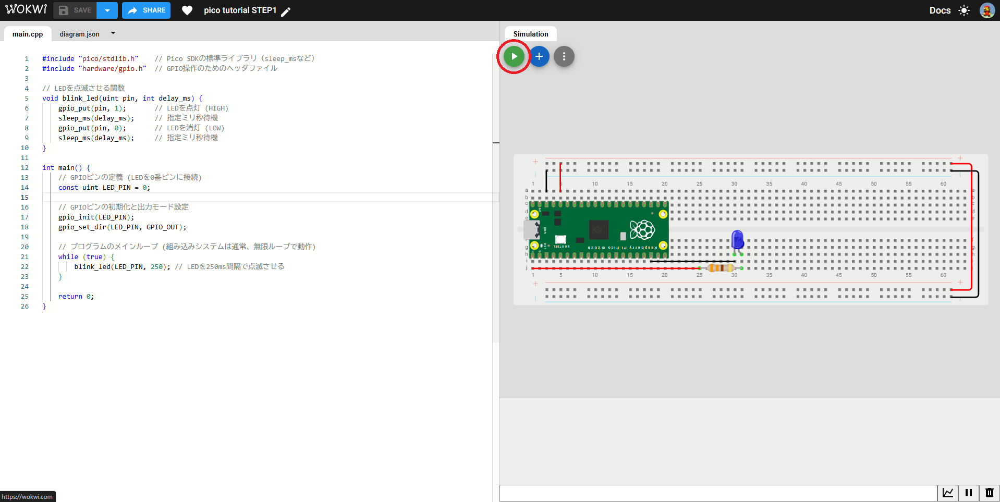
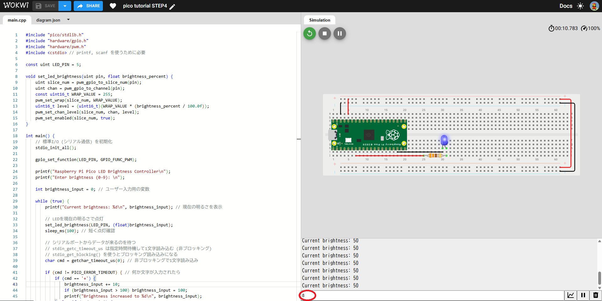

# RaspberryPiPicoを使用したC++マイコンプログラミング
Raspberry Pi Picoは、安価で高性能なマイクロコントローラーであり、C++との組み合わせは組み込みシステム開発の強力な基盤となります。このチュートリアルでは、PicoのC++ SDKを使って、基本的なハードウェア制御とC++のプログラミング概念を実践的に学んでいきます。

このチュートリアルで学べること
1. Raspberry Pi Pico C++ SDKの環境構築（概要）
1. PicoのGPIO（汎用入出力）を使ったLED点滅、ボタン入力
1. PWM（パルス幅変調）によるLEDの明るさ制御
1. シリアル通信を使ったPCとのデータ送受信（デバッグ出力・簡易入力）
1. C++の基本的なプログラミング要素：
   - **関数**（Function）
   - **ループ**（Loop: `while`, `for`）
   - **条件分岐**（Conditional: `if-else`, `switch-case`）
   - **配列**（Array）とポインタ（Pointer）
   - **クラス**（`Class`）とオブジェクト指向プログラミングの基礎

---

### ステップ0：事前準備と開発環境の構築（概要）
この入門ではWokwiというオンラインエミュレーターを使います。Wokwiはブラウザ上でRaspberry Pi PicoのC++プログラムを実行できるため、環境構築が不要で手軽に始められます。
実際にハードウェアを使う場合は、VS Codeで拡張機能をインストールし、USBでPicoを接続して開発することもできます。

### ステップ1：基本のLチカとGPIO出力（関数、無限ループ）
マイコンプログラミングの「Hello World」であるLED点滅（Lチカ）を作成します。

#### 部品の接続

Raspberry Pi PicoのGP5ピンに青色LEDを接続します。

Pico GP5ピン -- 抵抗（330Ω）-- LEDのアノード（長い足）
LEDのカソード（短い足）-- Pico GNDピン

#### プログラム
[ステップ1のプロジェクト](https://wokwi.com/projects/438807588779948033)
`main.cpp`
```cpp
#include "pico/stdlib.h"    // Pico SDKの標準ライブラリ（sleep_msなど）
#include "hardware/gpio.h"  // GPIO操作のためのヘッダファイル

// LEDを点滅させる関数
void blink_led(uint pin, int delay_ms) {
    gpio_put(pin, 1);       // LEDを点灯 (HIGH)
    sleep_ms(delay_ms);     // 指定ミリ秒待機
    gpio_put(pin, 0);       // LEDを消灯 (LOW)
    sleep_ms(delay_ms);     // 指定ミリ秒待機
}

int main() {
    // GPIOピンの定義 (LEDを5番ピンに接続)
    const uint LED_PIN = 5;

    // GPIOピンの初期化と出力モード設定
    gpio_init(LED_PIN);
    gpio_set_dir(LED_PIN, GPIO_OUT);

    // プログラムのメインループ (マイコンプログラムは通常、無限ループで動作)
    while (true) {
        blink_led(LED_PIN, 250); // LEDを250ms間隔で点滅させる
    }

    return 0;
}
```

#### ポイント

`#include`: 必要なライブラリやヘッダファイルを取り込みます。
`main()`関数: C++プログラムのエントリーポイント（ここから実行が始まります）。
`void blink_led(uint pin, int delay_ms)`: 引数（pin, delay_ms）を受け取り、何も返さない（void）blink_led関数を定義しています。コードの再利用性を高めます。
`const uint LED_PIN = 0;`: constキーワードを使うと、変数を定数（一度初期化したら変更できない値）として宣言できます。
`while(true)`: 無限ループを作成します。マイコンプログラムでは、電源が供給されている限りプログラムを実行し続けるためによく使われます。
`gpio_init()`, `gpio_set_dir()`, `gpio_put()`, `sleep_ms()`: Pico SDKが提供するGPIO制御と待機のための関数です。

#### 実行
プロジェクト内で実行ボタンを押すと、PicoのGP0ピンに接続されたLEDが250ミリ秒間隔で点滅します。Wokwiでは、LEDの状態がリアルタイムで表示されます。


#### 演習問題1

1. **点滅パターンの変更**
LEDの点灯時間を**200ms**、消灯時間を**800ms**に変更してください。
`blink_led`関数を改造し、点灯時間と消灯時間を別々に指定できるようにしてください。（例: `blink_led(pin, on_time_ms, off_time_ms)`）

2. **複数のLED点滅**
[演習問題用プロジェクト](https://wokwi.com/projects/438813408908681217)
PicoのGP16ピンにもう1つLEDを接続し、GP25のLEDとGP16のLEDが交互に点滅するようにプログラムを変更してください。
ヒント: 複数のgpio_initとgpio_set_dirを呼び出し、while(true)ループ内でそれぞれのLEDを個別に制御します。

---

### ステップ2：ボタン入力と条件分岐（if-else）
ボタンをPicoに接続し、その状態に応じてLEDの動作を変えてみましょう。

#### 部品の接続

Pico GP16ピン -- タクトスイッチの片方の足
タクトスイッチのもう片方の足 -- Pico GNDピン

Pico GP5ピン -- 抵抗（330Ω）-- LEDのアノード（長い足）
LEDのカソード（短い足）-- Pico GNDピン

（※`gpio_pull_up()`を使うので、外部にプルアップ抵抗は不要ですが、ブレッドボード上の配線はしっかり確認しましょう。）

#### プログラム
[ステップ2のプロジェクト](https://wokwi.com/projects/438813957447136257)
```cpp
#include "pico/stdlib.h"
#include "hardware/gpio.h"

// グローバル定数 (全ての関数からアクセス可能)
const uint LED_PIN = 5; // GP5ピンにLEDを接続
const uint BUTTON_PIN = 16; // GP16ピンにボタンを接続

// LEDを点滅させる関数 (前のステップと同じ)
void blink_led(uint pin, int delay_ms) {
    gpio_put(pin, 1);
    sleep_ms(delay_ms);
    gpio_put(pin, 0);
    sleep_ms(delay_ms);
}

int main() {
    // LEDピンの初期化
    gpio_init(LED_PIN);
    gpio_set_dir(LED_PIN, GPIO_OUT);

    // ボタンピンの初期化と入力モード設定、内部プルアップ抵抗有効化
    gpio_init(BUTTON_PIN);
    gpio_set_dir(BUTTON_PIN, GPIO_IN);
    gpio_pull_up(BUTTON_PIN); // 内部プルアップ抵抗を有効にする (ボタンが押されていない時にHIGH、押された時にLOWになる)

    while (true) {
        // ボタンの状態を読み取る (押されていない時に1、押された時に0)
        // C++では、0がfalse、0以外の値がtrueと評価される
        if (gpio_get(BUTTON_PIN) == 0) { // ボタンが押されたら (LOWになったら)
            // ボタンが押されている間、LEDを高速点滅
            blink_led(LED_PIN, 50); // 50ms間隔で点滅
        } else { // ボタンが押されていなければ
            // LEDをゆっくり点滅
            blink_led(LED_PIN, 500); // 500ms間隔で点滅
        }
    }

    return 0;
}
```

#### ポイント

`gpio_set_dir(BUTTON_PIN, GPIO_IN)`: ピンを入力モードに設定します。
`gpio_pull_up(BUTTON_PIN)`: 内部プルアップ抵抗を有効にします。これにより、ボタンが押されていないときにピンが**HIGH**（3.3V）になり、ボタンが押されるとGNDに接続されて**LOW**（0V）になります。
`gpio_get(BUTTON_PIN)`: GPIOピンの現在の状態（HIGH/LOW）を読み取ります。
`if-else`文: 条件（`gpio_get(BUTTON_PIN) == 0`）が真（`true`）の場合にifブロックを実行し、偽（`false`）の場合に`else`ブロックを実行します。

#### 演習問題2

1. **ボタン長押し検出**
ボタンが短く押された場合はGP25のLEDを1回点滅させ、ボタンが2秒以上長押しされた場合はGP25のLEDを3回点滅させるように変更してください。
ヒント: `gpio_get()`をループ内で繰り返し呼び出し、ボタンが押されている時間を計測します。

2. **トグル動作** (難)
ボタンを1回押すたびにLEDの状態が反転する（ONならOFF、OFFならON）ように変更してください。
ヒント: ボタンが「押された瞬間」を検出する必要があります。前のループでのボタンの状態を覚えておく変数（bool last_button_stateなど）を用意し、現在の状態と比較することで検出できます。

---

### ステップ3：PWM制御でLEDの明るさを変える（forループ、関数）
PWM（Pulse Width Modulation：パルス幅変調）を使って、LEDの明るさを滑らかに変化させてみましょう。

#### 部品の接続

Lチカと同じ接続（GP25にLED）でOKです。PWM機能は特定のGPIOピンで利用可能です。GP25はPWM機能に対応しています。

#### プログラム
[ステップ3のプロジェクト](https://wokwi.com/projects/438815369806749697)
```cpp
#include "pico/stdlib.h"
#include "hardware/gpio.h"
#include "hardware/pwm.h"   // PWM制御のためのヘッダファイル

const uint LED_PIN = PICO_DEFAULT_LED_PIN;

// LEDの明るさをPWMで設定する関数
void set_led_brightness(uint pin, float brightness_percent) {
    // PWMスライスの取得 (Picoの各PWMピンはスライスに属する)
    uint slice_num = pwm_gpio_to_slice_num(pin);
    // PWMチャネルの取得 (各スライスにはAとBの2つのチャネルがある)
    uint chan = pwm_gpio_to_channel(pin);

    // PWMの最大値 (周期) を設定
    // 0からwrap値までカウントアップしたら0に戻る
    // 例えば 255 にすると 0-255 の256段階
    const uint16_t WRAP_VALUE = 255; 
    pwm_set_wrap(slice_num, WRAP_VALUE);

    // デューティサイクル (明るさ) を設定
    // brightness_percent (0.0-100.0) を WRAP_VALUE に応じた値に変換
    uint16_t level = (uint16_t)(WRAP_VALUE * (brightness_percent / 100.0f));
    pwm_set_chan_level(slice_num, chan, level);

    // PWMを有効化
    pwm_set_enabled(slice_num, true);
}

int main() {
    // LEDピンをPWM機能に設定
    gpio_set_function(LED_PIN, GPIO_FUNC_PWM);

    while (true) {
        // LEDを徐々に明るくする
        for (float brightness = 0.0f; brightness <= 100.0f; brightness += 1.0f) {
set_led_brightness(LED_PIN, brightness);
            sleep_ms(10); // 10ms待機
        }
        sleep_ms(500); // 最大輝度で少し待機

        // LEDを徐々に暗くする
        for (float brightness = 100.0f; brightness >= 0.0f; brightness -= 1.0f) {
            set_led_brightness(LED_PIN, brightness);
            sleep_ms(10); // 10ms待機
        }
        sleep_ms(500); // 最小輝度で少し待機
    }

    return 0;
}
```

#### ポイント

*   **`#include "hardware/pwm.h"`**: PWM機能を使うために必要なヘッダファイルです。
*   **`set_led_brightness()`関数**: LEDの明るさをパーセンテージで設定するための関数です。
    *   `float`型を使っています。浮動小数点数（小数点以下の値を持つ数）を扱えます。
*   **`gpio_set_function(LED_PIN, GPIO_FUNC_PWM)`**: GPIOピンの機能をPWMモードに切り替えます。
*   **`pwm_set_wrap()`**: PWMの周期を設定します。この値が大きいほど、より細かい明るさの制御が可能になります。
*   **`pwm_set_chan_level()`**: デューティサイクル（ONになっている時間の割合）を設定します。この値が大きいほどLEDは明るくなります。
*   **`for`ループ**: 特定の回数だけ処理を繰り返す場合に便利です。ここでは`brightness`変数を0から100まで1ずつ増やしたり減らしたりしています。
    *   `for (初期化; 条件式; 更新式)` の形で記述します。

#### 演習問題3

1. **PWM周期と分解能の変更**
`set_led_brightness`関数内で設定している`WRAP_VALUE`の値を変更し、LEDの明るさのグラデーションの滑らかさや、PWM周波数を変更してみましょう。`pwm_set_clkdiv_int_frac()`関数も調べてみましょう。
ヒント: `WRAP_VALUE`を大きくすると分解能は上がりますが、Picoのクロック周波数によってはPWM周波数が下がります。

2. **ボタンで明るさ調整**
[演習問題のプロジェクト](https://wokwi.com/projects/438816069283560449)
ステップ2で接続したボタンを使って、ボタンが押されている間だけLEDの明るさが徐々に明るくなるように変更してください。ボタンを離したら明るさはその時点の値で固定され、再度押すと明るくなるのを再開するようにしましょう。
ヒント: ボタンの長押し検出と、forループによる明るさの変化を組み合わせます。

---

### ステップ4：シリアル通信でデバッグ出力とユーザー入力（printf）

PicoとPCの間でシリアル通信を行い、プログラムの動作状況をPCのターミナルに表示したり、PCから簡単なコマンドを受け取ったりしてみましょう。

#### プログラム
```cpp
#include "pico/stdlib.h"
#include "hardware/gpio.h"
#include "hardware/pwm.h"
#include <cstdio> // printf, scanf を使うために必要

const uint LED_PIN = 5;

void set_led_brightness(uint pin, float brightness_percent) {
    uint slice_num = pwm_gpio_to_slice_num(pin);
    uint chan = pwm_gpio_to_channel(pin);
    const uint16_t WRAP_VALUE = 255; 
    pwm_set_wrap(slice_num, WRAP_VALUE);
    uint16_t level = (uint16_t)(WRAP_VALUE * (brightness_percent / 100.0f));
    pwm_set_chan_level(slice_num, chan, level);
    pwm_set_enabled(slice_num, true);
}

int main() {
    // 標準I/O (シリアル通信) を初期化
    stdio_init_all(); 

    gpio_set_function(LED_PIN, GPIO_FUNC_PWM);

    printf("Raspberry Pi Pico LED Brightness Controller\n");
    printf("Enter brightness (0-9): \n");

    int brightness_input = 0; // ユーザー入力用の変数

    while (true) {
        printf("Current brightness: %d\n", brightness_input); // 現在の明るさを表示

        // LEDを現在の明るさで点灯
        set_led_brightness(LED_PIN, (float)brightness_input);
        sleep_ms(100); // 短く点灯確認

        // シリアルポートからデータが来るのを待つ
        // stdin_getc_timeout_us は指定時間待機して1文字読み込む (非ブロッキング)
        // stdio_get_blocking() を使うとブロッキング読み込みになる
        char cmd = getchar_timeout_us(0); // 非ブロッキングで1文字読み込み

        if (cmd != PICO_ERROR_TIMEOUT) { // 何か文字が入力されたら
            if (cmd == '+') {
                brightness_input += 10;
                if (brightness_input > 100) brightness_input = 100;
                printf("Brightness increased to %d\n", brightness_input);
            } else if (cmd == '-') {
                brightness_input -= 10;
                if (brightness_input < 0) brightness_input = 0;
                printf("Brightness decreased to %d\n", brightness_input);
            } else if (cmd >= '0' && cmd <= '9') {
                // 数字が直接入力された場合、その数字を明るさに設定 (簡略化)
                brightness_input = (cmd - '0') * 10; // '5' -> 50
                if (brightness_input > 100) brightness_input = 100;
                printf("Brightness set to %d\n", brightness_input);
            }
        }
        sleep_ms(500); // 次のループまで待機
    }

    return 0;
}
```
#### ポイント

*   **`#include <cstdio>`**: C言語由来の標準入出力関数（`printf`, `scanf`など）を使うために必要です。
*   **`stdio_init_all()`**: Picoの標準I/O機能を初期化します。これにより、USB経由でPCのシリアルターミナルと通信できるようになります。
*   **`printf("...");`**: 文字列や変数の値をPCのシリアルターミナルに出力します。デバッグや情報の表示に非常に役立ちます。
    *   `%d`: 整数値のプレースホルダー
    *   `%c`: 文字のプレースホルダー
    *   `\n`: 改行
*   **`getchar_timeout_us(0)`**: シリアル入力バッファから1文字読み取ります。`0`はタイムアウトを意味し、非ブロッキング読み込みになります（入力がなければすぐに`PICO_ERROR_TIMEOUT`を返す）。
*   **`if (cmd != PICO_ERROR_TIMEOUT)`**: 入力があったかどうかを判定します。

**実行方法:**
実行したら、右下のターミナルにメッセージが表示され、赤丸部分に`+`や`-`キーを入力するとLEDの明るさが変化し、その変化がターミナルに表示・LEDの明るさが変化するはずです。


#### 演習問題4

1. **詳細なデバッグ出力**
これまでのプログラムの任意の箇所に`printf`文を追加し、プログラムの実行フローや変数の値がどのように変化しているか、シリアルターミナルで確認できるようにしてください。
例:「`ボタンが押されました`」「`LEDがONになりました`」「`現在の明るさ：%d`」など。

---

### ステップ5：配列とSwitch-Case文（複数のLEDパターン）

複数のLEDを制御したり、ユーザーの選択に応じて複数の動作パターンを切り替えたりする際に、配列と`switch-case`文が役立ちます。

#### 部品の接続

追加で2つのLEDをPicoのGP5とGP6ピンに接続してみましょう。
*   **Pico GP5ピン** -- 抵抗（330Ω）-- LEDのアノード -- LEDのカソード -- **Pico GNDピン**
*   **Pico GP6ピン** -- 抵抗（330Ω）-- LEDのアノード -- LEDのカソード -- **Pico GNDピン**

#### プログラム
[ステップ5のプロジェクト](https://wokwi.com/projects/438816864845576193)
```cpp
#include "pico/stdlib.h"
#include "hardware/gpio.h"
#include <cstdio> 

// LEDピンの配列と、配列の要素数を定義
const uint LED_PINS[] = {PICO_DEFAULT_LED_PIN, 5, 6}; // GP25, GP5, GP6
const int NUM_LEDS = sizeof(LED_PINS) / sizeof(LED_PINS[0]); // 配列の要素数を計算

// LEDを点滅させる関数 (配列とポインタの概念)
// 'pins' は配列の先頭要素へのポインタとして渡されます
void flash_all_leds(const uint* pins, int count, int delay_ms) {
    printf("Flashing all LEDs...\n");
    for (int i = 0; i < count; ++i) {
        gpio_put(pins[i], 1); // ポインタを配列のようにアクセス
    }
    sleep_ms(delay_ms);
    for (int i = 0; i < count; ++i) {
        gpio_put(pins[i], 0);
    }
    sleep_ms(delay_ms);
}

// LEDを順番に点灯させる関数 (配列の利用)
void chase_leds(const uint* pins, int count, int delay_ms) {
    printf("Chasing LEDs...\n");
    for (int i = 0; i < count; ++i) {
        gpio_put(pins[i], 1);
        sleep_ms(delay_ms);
        gpio_put(pins[i], 0);
    }
}

// 全てのLEDを消灯する関数
void turn_off_all_leds(const uint* pins, int count) {
    for (int i = 0; i < count; ++i) {
        gpio_put(pins[i], 0);
    }
}

int main() {
    stdio_init_all();

    // 全てのLEDピンを初期化し、出力モードに設定
    for (int i = 0; i < NUM_LEDS; ++i) {
        gpio_init(LED_PINS[i]);
        gpio_set_dir(LED_PINS[i], GPIO_OUT);
    }
    turn_off_all_leds(LED_PINS, NUM_LEDS); // 初期化時に全て消灯

    printf("--- LED Pattern Selector ---\n");
    printf("1: Flash All LEDs\n");
    printf("2: Chase LEDs\n");
    printf("3: Turn Off All LEDs\n");
    printf("Enter choice (1-3): \n");

    int choice = 0;

    while (true) {
        // 非ブロッキングで1文字読み込み
        char input_char = getchar_timeout_us(0);

        if (input_char != PICO_ERROR_TIMEOUT) {
            // 数字を整数に変換
            if (input_char >= '1' && input_char <= '3') {
                choice = input_char - '0'; // '1'を1に変換など
                printf("Choice selected: %d\n", choice);
            }
        }

        // switch-case文で選択に応じて処理を分岐
        switch (choice) {
            case 1: // 全LED点滅
                flash_all_leds(LED_PINS, NUM_LEDS, 200);
                break; // breakがないと次のcaseも実行されてしまう
            case 2: // 順番に点灯
                chase_leds(LED_PINS, NUM_LEDS, 100);
                break;
            case 3: // 全消灯
                turn_off_all_leds(LED_PINS, NUM_LEDS);
                sleep_ms(500); // 消灯状態を維持
                break;
            default: // 何も選択されていないか、無効な選択の場合
                printf("Waiting for selection...\n");
                sleep_ms(1000); // 何もせず待機
                break;
        }
    }

    return 0;
}
```

#### ポイント

*   **配列 (const uint LED_PINS[] = { ... };)**: 同じ型の複数のデータを1つの名前でまとめて管理できます。LED_PINS[0], LED_PINS[1]のようにインデックスを使ってアクセスします。
*   **配列の要素数計算 (sizeof(LED_PINS) / sizeof(LED_PINS[0]))**: 配列全体のバイト数を1つの要素のバイト数で割ることで、要素数を動的に計算できます。
*   **ポインタ (const uint* pins)**:
    *   ポインタは変数の**メモリアドレス**を格納する変数です。
    *   配列の名前（LED_PINS）は、その配列の先頭要素へのポインタとして機能します。そのため、flash_al
l_leds関数やchase_leds関数では、const uint* pinsというポインタ引数で配列を受け取ることができます。
    *   ポインタを使って配列の要素にアクセスする際も、pins[i]のように配列と同じ構文でアクセスできます。
    *   **ポインタの基本的な考え方:**
        *   int my_var = 10;
        *   int* ptr = &my_var; (&は「アドレス演算子」: 変数のアドレスを取得)
        *   printf("%d", ptr); (は「間接参照演算子」: ポインタが指すアドレスにある値を取得)
*   **switch-case文**: 1つの変数（この場合choice）の値に基づいて、複数の異なる処理ブロックの中から1つを選択して実行する場合に便利です。
    *   break;がないと、選択されたcase以下のcaseブロックも続けて実行されてしまうため、注意が必要です。

#### 演習問題5

1. **新しいLEDパターンを追加**
main関数内のswitch-case文に新しいcaseを追加し、4が入力された場合に実行される独自のLEDパターン（例: すべてのLEDをランダムな順序で点滅させる、流れるように光らせるなど）を作成してください。
ヒント: pico/rand.hをインクルードし、rand()関数を使って乱数を生成してみましょう。（srand()で乱数シードの設定も考慮）

---

### ステップ6：クラスを使ったGPIO制御の抽象化とオブジェクト指向プログラミングの基礎

C++の強力な特徴の1つである「クラス」を使って、GPIO操作をより抽象的で再利用しやすい形にまとめてみましょう。

#### プログラム
[ステップ6のプロジェクト](https://wokwi.com/projects/438817255022846977)
```cpp
#include "pico/stdlib.h"
#include "hardware/gpio.h"
#include "hardware/pwm.h"
#include <cstdio>

// Ledクラスの定義
class Led {
private: // このクラスの内部からのみアクセス可能なメンバー
    uint pin_number; // LEDが接続されているGPIOピン番号
    bool is_pwm_mode; // 現在PWMモードかどうか
    float current_brightness; // 現在の明るさ (0.0f-100.0f) を保持

public: // このクラスの外部からアクセス可能なメンバー (インターフェース)
    // コンストラクタ：Ledオブジェクトが作成されるときに自動的に呼び出される
    // enable_pwmをtrueにするとPWMモードで初期化
    Led(uint pin, bool enable_pwm = false) {
        pin_number = pin;
        is_pwm_mode = enable_pwm;
        current_brightness = 0.0f; // 初期状態は消灯

        if (is_pwm_mode) {
            gpio_set_function(pin_number, GPIO_FUNC_PWM);
            uint slice_num = pwm_gpio_to_slice_num(pin_number);
            const uint16_t WRAP_VALUE = 255; 
            pwm_set_wrap(slice_num, WRAP_VALUE);
            pwm_set_enabled(slice_num, true); // PWMを有効化
            setBrightness(0.0f); // 初期は消灯
        } else {
            gpio_init(pin_number);
            gpio_set_dir(pin_number, GPIO_OUT);
            turnOff(); // 初期は消灯
        }
    }

    // LEDを点灯させるメソッド
    void turnOn() {
        if (!is_pwm_mode) { // GPIOモードでなければ
            gpio_put(pin_number, 1);
        } else { // PWMモードであれば最大輝度
            setBrightness(100.0f);
        }
        current_brightness = 100.0f; // 状態を更新
    }

    // LEDを消灯させるメソッド
    void turnOff() {
        if (!is_pwm_mode) {
            gpio_put(pin_number, 0);
        } else {
            setBrightness(0.0f);
        }
        current_brightness = 0.0f; // 状態を更新
    }

    // LEDの状態を反転させるメソッド
    void toggle() {
        if (!is_pwm_mode) {
            // GPIOモードなら現在のピンの状態を直接取得して反転
            gpio_put(pin_number, !gpio_get(pin_number));
            // 状態を更新
            current_brightness = gpio_get(pin_number) ? 100.0f : 0.0f;
        } else {
            // PWMモードでは、保持している明るさに基づいてトグル
            if (current_brightness > 0.0f) {
                setBrightness(0.0f); // 現在点灯していれば消灯
            } else {
                setBrightness(100.0f); // 現在消灯していれば点灯
            }
            // setBrightness() メソッド内で current_brightness は更新される
        }
    }

    // LEDを指定回数点滅させるメソッド
    void blink(int count, int delay_ms) {
        for (int i = 0; i < count; ++i) {
            turnOn();
            sleep_ms(delay_ms);
            turnOff();
            sleep_ms(delay_ms);
        }
    }

    // LEDの明るさを設定するメソッド (PWMモード時のみ有効)
    void setBrightness(float brightness_percent) {
        if (is_pwm_mode) {
            if (brightness_percent < 0.0f) brightness_percent = 0.0f;
            if (brightness_percent > 100.0f) brightness_percent = 100.0f;

            uint slice_num = pwm_gpio_to_slice_num(pin_number);
            uint chan = pwm_gpio_to_channel(pin_number);
            const uint16_t WRAP_VALUE = 255;
            uint16_t level = (uint16_t)(WRAP_VALUE * (brightness_percent / 100.0f));
            pwm_set_chan_level(slice_num, chan, level);
            current_brightness = brightness_percent; // 内部状態を更新
        } else {
            printf("Warning: Cannot set brightness. LED is not in PWM mode.\n");
        }
    }

    // LEDが現在点灯しているか（明るさが0以上か）を返すメソッド
    bool isOn() const {
        return current_brightness > 0.0f;
    }

    // 現在のLEDの明るさを返すメソッド
    float getBrightness() const {
        return current_brightness;
    }
};

int main() {
    stdio_init_all();

    // Ledクラスのオブジェクトを作成 (オンボードLEDはPWMモードで)
    Led onboardLed(PICO_DEFAULT_LED_PIN, true); // GP25をPWMモードで初期化

    // 別のピンに接続した外部LED (GPIOオンオフモードで)
    Led externalLed1(5); // GP5をGPIOオンオフモードで初期化
    Led externalLed2(6); // GP6をGPIOオンオフモードで初期化

    printf("Starting LED control with objects...\n");

    while (true) {
        // onboardLedオブジェクトのメソッドを呼び出す
        printf("Onboard LED cycle:\n");
        for (float brightness = 0.0f; brightness <= 100.0f; brightness += 5.0f) {
            onboardLed.setBrightness(brightness);
            sleep_ms(50);
        }
        for (float brightness = 100.0f; brightness >= 0.0f; brightness -= 5.0f) {
            onboardLed.setBrightness(brightness);
            sleep_ms(50);
        }
        sleep_ms(1000);

        // externalLed1オブジェクトのメソッドを呼び出す
        printf("External LED 1 blinking:\n");
        externalLed1.blink(3, 150); // 3回、150ms間隔で点滅
        sleep_ms(1000);

        // externalLed2オブジェクトのメソッドを呼び出す
        printf("External LED 2 toggling:\n");
        externalLed2.toggle(); // 現在の状態を反転
        sleep_ms(500);
        externalLed2.toggle(); // もう一度反転
        sleep_ms(500);
        externalLed2.turnOff(); // 消灯

        sleep_ms(2000); // 各サイクル間の待機
    }

    return 0;
}
```

#### ポイント

*   **クラス (`class Led { ... };`)**:
    *   関連するデータ（メンバー変数：`pin_number`, `is_pwm_mode`）と、そのデータを操作する関数（メンバー関数 / メソッド：`turnOn()`, `setBrightness()`など）を1つのまとまりとして定義します。
    *   **カプセル化**: `private`で宣言されたメンバーはクラスの外部から直接アクセスできません。`public`で宣言されたメンバーだけが外部からアクセス可能です。これにより、オブジェクトの内部構造が隠蔽され、安全性が高まります。
*   **オブジェクト (`Led onboardLed(...)`, `Led externalLed1(...)`)**:
    *   クラスは「設計図」のようなもので、その設計図に基づいて実際にメモリ上に作成されたものが「オブジェクト」（インスタンスとも呼ばれます）です。
    *   `Led onboardLed(PICO_DEFAULT_LED_PIN, true);` のようにクラス名を型として変数を宣言すると、Ledクラスのオブジェクトが作成されます。
*   **コンストラクタ (Led(uint pin, bool enable_pwm = false))**:
    *   オブジェクトが作成されるときに自動的に呼び出される特別なメソッドです。オブジェクトの初期化処理（この場合はGPIOの初期化）を行います。
    *   `bool enable_pwm = false`は、引数にデフォルト値が設定されていることを示します。`Led externalLed1(6);`のように引数を省略すると`enable_pwm`は`false`になります。
*   **メソッドの呼び出し (`onboardLed.turnOn()`)**:
    *   作成したオブジェクトの後に`.`（ドット演算子）を付けて、そのオブジェクトが持つメソッドを呼び出します。

クラスを導入することで、異なるピンに接続されたLEDをそれぞれ独立したオブジェクトとして扱い、同じメソッド（`turnOn()`, `blink()`など）で操作できるようになります。これは、大規模なプログラムや複雑なハードウェアを扱う際に非常に重要な概念です。

#### 演習問題

1. **Buttonクラスの作成**
`Led`クラスと同様に、ボタンの操作（初期化、状態読み取り、プルアップ設定）をカプセル化する`Button`クラスを作成してください。
`Button`クラスには、以下のようなメソッドを持たせましょう:
コンストラクタ: `Button(uint pin_number, bool pull_up = true)`
`isPressed()`: ボタンが押されているか（LOW状態か）を返すbool型のメソッド。
`wasPressed()`: ボタンが「押された瞬間」（前回の状態からHIGH->LOWに変化した瞬間）を検出するメソッド。
`main`関数でこの`Button`クラスのオブジェクトをインスタンス化し、LEDの点滅パターンを`Button`オブジェクトを使って制御するように変更してください。

1. **Ledクラスの拡張**
`Led`クラスに、LEDの現在の状態（ON/OFF）を返すbool型の`isOn()`メソッドを追加してください。
`Led`クラスの`toggle()`メソッドを改善し、`isOn()`メソッドを使って現在の状態を判断するように変更してください。

1. **Ledクラスの拡張**
`Led`クラスに、`setBrightness()`メソッドだけでなく、現在のPWMデューティサイクルを取得する`getBrightness()`メソッドを追加してみましょう。

1. **複数のLedオブジェクトと配列**
ステップ5で使った`LED_PINS`配列の代わりに、`Led`オブジェクトの配列を作成し、ループを使って複数の`LED`オブジェクトをまとめて操作できるように変更してください。
例: `Led leds[] = {Led(PICO_DEFAULT_LED_PIN), Led(5), Led(6)}`;
`Led`クラスに、`setBrightness()`メソッドだけでなく、現在のPWMデューティサイクルを取得する`getBrightness()`メソッドを追加してみましょう。

1. **複数の`Led`オブジェクトと配列**
ステップ5で使った`LED_PINS`配列の代わりに、`Led`オブジェクトの配列を作成し、ループを使って複数の`LED`オブジェクトをまとめて操作できるように変更してください。
例: `Led leds[] = {Led(PICO_DEFAULT_LED_PIN), Led(5), Led(6)}`;

---

### まとめと次のステップ

このチュートリアルでは、Raspberry Pi Pico C++ SDKを使って、C++プログラミングの基本的な概念とPicoのハードウェア制御を学びました。GPIO入出力、PWM制御、シリアル通信を体験し、C++の関数、ループ、条件分岐、配列、ポインタ、クラスといった要素をコードに組み込みました。

これらは組み込みシステム開発における基礎の基礎です。
次に挑戦すべきこととして、いくつかアイデアを挙げます。

*   **複数のボタン入力:** 複数のボタンを接続し、それぞれのボタンで異なるLEDパターンを切り替えたり、複数のLEDを個別に制御したりしてみましょう。
*   **ADC（アナログ-デジタル変換）:** 可変抵抗（ボリューム）などをPicoのADCピンに接続し、抵抗値の変化を読み取ってLEDの明るさを調整するプログラムを作成してみましょう。
*   **タイマー割り込み:** `sleep_ms()`の代わりに、特定の時間間隔で自動的に実行される割り込み処理を使って、より正確な時間管理を学びましょう。
*   **I2C / SPI 通信:** 温度センサー、LCDディスプレイ、モータードライバなど、他の電子部品とPicoを接続し、I2CやSPIといった通信プロトコルを使って制御してみましょう。

Raspberry Pi PicoとC++の組み合わせは、電子工作のアイデアを形にする強力なツールです。ぜひ、さまざまなプロジェクトに挑戦して、組み込みプログラミングのスキルを磨いていってください！