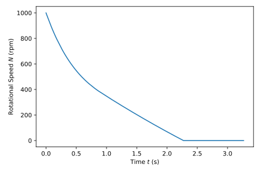
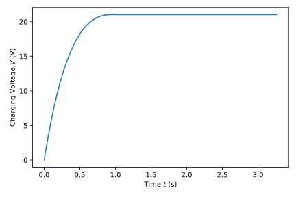
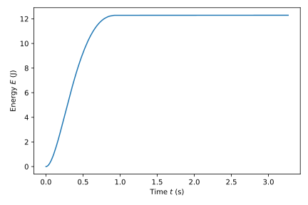
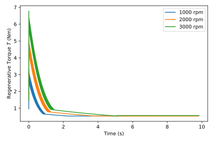
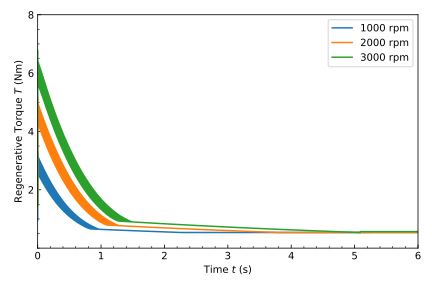
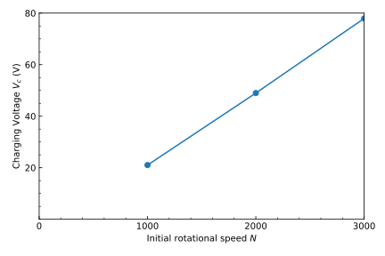
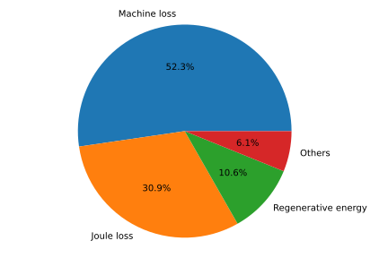
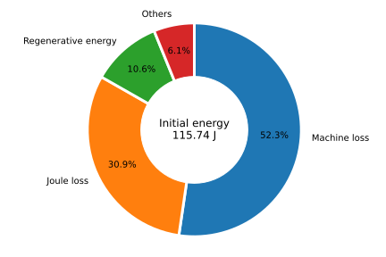

# Pythonによるデータ分析と可視化

この講座では、Pythonの主要なデータ分析ライブラリであるPandasと、グラフ描画ライブラリであるMatplotlibを使用して、CSV形式の時系列データを読み込み, 加工し, 視覚的に分析する基礎を習得します。プログラミング初心者でも、実際のデータ分析のワークフローを体験できるよう、丁寧に解説します。

このチュートリアルで学べること
1. CSVファイルの読み込みとデータフレームの作成
2. データの前処理とクリーニング
3. 基本的な統計量の計算
4. データの可視化（折れ線グラフ、円グラフなど）

---

### ステップ0:環境構築とツールの準備
データ分析を始めるには、Python本体と、必要なライブラリがインストールされた環境が必要です。この講座では、データサイエンス分野で広く使われているAnacondaを利用します。Anacondaは、Python本体に加え、PandasやMatplotlibといった主要なライブラリが最初から含まれているため、個別にインストールする手間が省けて非常に便利です。コードの記述と実行には、多機能なコードエディタである **Visual Studio Code (VS Code)** を使用します。

#### 1. Anacondaのインストール

まずは、AnacondaをPCにインストールします。

1. Anacondaの公式サイトにアクセスし、お使いのOS（Windows、macOS、Linux）に合ったインストーラーをダウンロードします。

2. ダウンロードしたインストーラーを実行し、画面の指示にしたがって進めてください。特別な設定は不要で、基本的に「次へ」や「同意する」を選択すれば問題ありません。

#### 2. Visual Studio Code（VS Code）のインストール
次に、Pythonのコードを記述・実行するためのエディタ、VS Codeをインストールします。

1. VS Codeの公式サイトにアクセスし、お使いのOSに合ったインストーラーをダウンロードします。

2. ダウンロードしたインストーラーを実行し、画面の指示にしたがってインストールを進めます。

#### 3. VS CodeにPython拡張機能をインストール
VS CodeでPythonを快適に扱うために、拡張機能をインストールします。

1. VS Codeを起動します。

2. 左側のアクティビティバーにある拡張機能のアイコン（四角が並んだようなアイコン）をクリックします。

3. 検索バーに「Python」と入力し、Microsoftが提供している公式のPython拡張機能を見つけて「インストール」ボタンをクリックします。

4. ライブラリの確認とコードの実行
これで準備は完了です。Anacondaに含まれているPandasとMatplotlibが正しく使えるか確認してみましょう。

VS Codeで新しいファイルを作成し、`data_analysis.py`などの名前で保存します。

以下のコードをファイルに記述します。

```Python

import pandas as pd
import matplotlib.pyplot as plt

print("Import matplotlib and pandas was successful.")
```
コードを記述したファイルを開いた状態で、左上の実行ボタン▶を押します。
`Import matplotlib and pandas was successful.`と表示されれば、環境構築は成功です。

---

### ステップ1: Pandasの基礎 - CSVデータの読み込みと準備
この章では、Pythonのデータ分析ライブラリであるPandasの基本的な使い方を学びます。まずは、添付されたCSV形式の時系列データを読み込み、分析しやすいように準備する一連の作業を行います。

#### 1. PandasとDataFrameの基本
Pandasは、表形式のデータを扱うための強力なツールです。Pandasの核となるデータ構造は`DataFrame`と呼ばれ、これはスプレッドシートやデータベースのテーブルのようなものだと考えてください。行と列を持つ表形式のデータで、各列には名前（カラム名）がついています。

#### 2. CSVファイルの読み込み
それでは、実際に`original.csv`ファイルを読み込んでみましょう。VS Codeで新しいPythonファイルを作成し、以下のコードを記述して実行します。

```Python
import pandas as pd

# CSVファイルを読み込み、DataFrameに格納する
df = pd.read_csv('csv/step1/original.csv')

# 読み込んだデータの最初の5行を表示して確認する
print(df.head())
```

`pd.read_csv()`関数は、CSVファイルを読み込んで`DataFrame`として返します。`df.head()`は、読み込んだDataFrameの最初の5行を表示する便利なメソッドです。データが正しく読み込まれたかを確認する際に役立ちます。実行結果から、ファイルには`Time`という時系列データを含む列があることがわかります。

#### 3. 不要なデータの削除
まずデータの前処理を行います。今回はTrigger列の値が1になる前のデータは不要なため、これを削除します。

```Python
import pandas as pd

# 'csv/original.csv'ファイルをDataFrameとして読み込む
df = pd.read_csv('csv/step1/original.csv')

# Trigger = 1となる前の不要データを削除
first_index = df[df['Trigger'] == 1].index[0]
df = df.loc[first_index:].reset_index(drop=True)

# Trigger = 1となる最初の行のTimeを0に設定
first_time = df['Time'].iloc[0]
df['Time'] = df['Time'] - first_time

# 削除後のデータを新しいCSVファイルに保存
df.to_csv('csv/step1/trimmed.csv', index=False)

print("DataFrame was trimmed and saved to 'csv/step1/trimmed.csv'.")
print(df.head())
```

##### 実行結果の確認
VS Codeで実行すると、プログラムが実行され、以下のような結果が出力されます。
```
DataFrame was trimmed and saved to 'csv/step1/trimmed.csv'.
     Time  RegenerativeCurrent  ...         T  ChargingVoltage_RC
0  0.0000             0.173898  ...  0.082082            0.791315
1  0.0001             0.927717  ...  0.516167            4.222209
2  0.0002             1.516481  ...  0.857227            6.903305
3  0.0003             1.974377  ...  1.126310            8.989889
4  0.0004             2.328380  ...  1.340993           10.604488

[5 rows x 9 columns]
```


#### 4. 静電エネルギーの計算
`original.csv`ファイルには、コンデンサの電圧データが含まれています。このデータを用いて、静電エネルギーを計算してみましょう。静電エネルギー $E$ は、コンデンサの容量 $C$ と電圧 $V$ を用いて、以下の式で求められます。

$ E = \frac{1}{2} C V^2 $

今回はコンデンサの容量を $C=0.0556$ Fと設定します。`original.csv`の`ChargingVoltage_C`列が電圧$V$にあたります。

```Python
import pandas as pd

# コンデンサの容量Cを定義
C = 0.0556

# 不要データ削除済みのデータを読み込む
# 'csv/step1/trimmed.csv'ファイルをDataFrameとして読み込む
df = pd.read_csv('csv/step1/trimmed.csv')

# 静電エネルギーを計算する: E = 0.5 * C * V ^ 2
# ** でべき乗を計算
# ここで V は 'ChargingVoltage_C' 列の値
df['ElectrostaticEnergy'] = 0.5 * C * (df['ChargingVoltage_C'] ** 2)

# 新しい列が追加されたDataFrameの最初の5行を表示して確認
print("DataFrame was updated with the ElectrostaticEnergy column:")
print(df.head())

# 加工したDataFrameを新しいCSVファイルに保存
output_filename = 'csv/step1/calculated_energy.csv'
df.to_csv(output_filename, index=False)

print(f"DataFrame was saved to '{output_filename}'.")
```

##### 実行結果の確認
VS Codeで実行すると、プログラムが実行され、以下のような結果が出力されます。

```Plaintext
DataFrame was updated with the ElectrostaticEnergy column:
     Time  RegenerativeCurrent  ...  ChargingVoltage_RC  ElectrostaticEnergy
0  0.0000             0.173898  ...            0.791315         1.792264e-10
1  0.0001             0.927717  ...            4.222209         3.353890e-08
2  0.0002             1.516481  ...            6.903305         3.060782e-07
3  0.0003             1.974377  ...            8.989889         1.165401e-06
4  0.0004             2.328380  ...           10.604488         2.982451e-06

[5 rows x 10 columns]
DataFrame was saved to 'csv/step1/calculated_energy.csv'.
```

上記の結果から、`DataFrame`に`ElectrostaticEnergy`という新しい列が追加されていることが確認できます。また、csvフォルダ内に`calculated_energy.csv`という新しいファイルが作成されています。

これで、データ分析に必要な準備が整いました。次の章では、このデータを使って各種データの分析を行います。

#### 演習問題
**1.ジュール損の計算**
 `RegenerativeCurrent`と抵抗値$R$=10 Ωから抵抗でのジュール損失を計算し、新しい列`JouleLoss`を追加してください。

**2.減速度の計算**
`RotationalSpeed`を微分し、`Deceleration`という新しい列を追加してください。

---

### ステップ2: データ分析
この章では、前章で作成したデータフレームを基に、複数のCSVファイルから特定の値を抽出し、集計する方法を学びます。この作業は、複数の実験結果を比較したり、データセット全体の傾向を把握したりする際に非常に役立ちます。

ここでは、csv/step2/trimmed_1000.csv、csv/step2/trimmed_2000.csv、csv/step2/trimmed_3000.csvという3つのファイルを使用します。

**1. 抽出・集計する値の定義**
各ファイルから以下の値を抽出し、1つの表にまとめます。
- `RegenerativeCurrent`の最大値
- `RotationalSpeed`（N）が0.1以下となる最初の`Time`の値
- `N`が0.1以下となる最初の`ChargingVoltage_C`の値
- `N`が0.1以下となる最初の`ElectrostaticEnergy`の値
これらの値を、Pandasの`DataFrame`を使って集計し、最終的に1つのCSVファイルに保存します。

**2. Pythonスクリプトの作成**
このスクリプトは、指定された3つのファイルを順番に処理し、上記で定義した値を抽出・集計します。

注： このコードを実行する前に、csv/step2/trimmed_1000.csv、csv/step2/trimmed_2000.csv、csv/step2/trimmed_3000.csvの3つのファイルが所定の場所に存在している必要があります。

```Python
import pandas as pd
import os

# 結果を保存するための空のDataFrameを作成
results_df = pd.DataFrame()

# 処理するファイル名のリスト
filenames = ['trimmed_1000.csv', 'trimmed_2000.csv', 'trimmed_3000.csv']

# 結果を格納する空のリスト
results = []

# 各ファイルをループして処理
for filename in filenames:
    file_path = os.path.join('csv', 'step2', filename)
    
    # ファイルが存在するか確認
    if not os.path.exists(file_path):
        print(f"Warning: File {filename} was not found. Skipping.")
        continue
    
    # ファイル名からNの値を抽出
    # '_'で区切った2つ目の要素を'.'で区切って整数に変換
    N = int(filename.split('_')[1].split('.')[0])

    # CSVファイルを読み込み
    df = pd.read_csv(file_path)

    # 1. RegenerativeCurrentの最大値を抽出
    max_regen_current = df['RegenerativeCurrent'].max()
    
    # 2. RotationalSpeed (N)が0.1以下となる最初の行を抽出
    first_low_speed = df[df['RotationalSpeed'] <= 0.1].head(1)
    
    # 該当する行が見つかった場合
    if not first_low_speed.empty:
        time_at_low_speed = first_low_speed['Time'].iloc[0]
        voltage_at_low_speed = first_low_speed['ChargingVoltage_C'].iloc[0]
        energy_at_low_speed = first_low_speed['ElectrostaticEnergy'].iloc[0]
    else:
        # 見つからない場合はNoneを代入
        time_at_low_speed = None
        voltage_at_low_speed = None
        energy_at_low_speed = None

    # 結果を辞書としてリストに追加
    results.append({
        'N': N,
        'Max_RegenerativeCurrent': max_regen_current,
        'Time_at_Stop': time_at_low_speed,
        'ChargingVoltage_C_at_Stop': voltage_at_low_speed,
        'ElectrostaticEnergy_at_Stop': energy_at_low_speed
    })

# リストからDataFrameを作成
results_df = pd.DataFrame(results)

print("Results:")
print(results_df)

# 結果を新しいCSVファイルに保存
output_filename = 'csv/step2/result.csv'
results_df.to_csv(output_filename, index=False, encoding='utf-8')

print(f"\nResults have been saved to '{output_filename}'.")
```

##### 実行結果の確認
このスクリプトを実行すると、以下のような集計結果がコンソールに表示されます。

```Plaintext
Results:
      N  ...  ElectrostaticEnergy_at_Stop
0  1000  ...                    12.292394
1  2000  ...                    66.680670
2  3000  ...                   168.854383

[3 rows x 5 columns]

Results have been saved to 'csv/step2/result.csv'.
```
また、`csv/step2`フォルダ内に`result.csv`というファイルが作成され、集計されたデータが保存されます。これで、複数のファイルにまたがるデータの集計と保存が完了しました。

---

### ステップ3: Matplotlibの基礎 - 時系列データの可視化
この章では、Pythonのグラフ描画ライブラリであるMatplotlibを使って、時系列データを視覚的に分析する方法を学びます。グラフはデータの傾向、パターン、異常値を直感的に理解する上で不可欠なツールです。

**1. 単一CSVデータのグラフ作成**
まずは、ステップ1で作成した`csv/step1/trimmed.csv`ファイルを使って、主要な3つの項目を個別のグラフで可視化します。横軸に`Time`をとり、それぞれ`RotationalSpeed`、`ChargingVoltage_C`、`ElectrostaticEnergy`を縦軸にプロットします。

```Python
import pandas as pd
import matplotlib.pyplot as plt
import os

# グラフ保存用のディレクトリを作成
plot_dir = 'plots/step3'
if not os.path.exists(plot_dir):
    os.makedirs(plot_dir)

# データを読み込む
try:
    df = pd.read_csv('csv/step1/calculated_energy.csv')
    print("Data was loaded successfully.")
except FileNotFoundError:
    print("Error: 'csv/step1/calculated_energy.csv' file not found.")
    exit()

# 1. RotationalSpeedのグラフを作成
plt.figure(figsize=(6, 4))
# 横軸にTime, 縦軸にRotationalSpeedを設定
plt.plot(df['Time'], df['RotationalSpeed'])
# 軸ラベルの設定
plt.xlabel('Time $t$ (s)')
plt.ylabel('Rotational Speed $N$ (rpm)')
# 余分なスペースを削除
plt.tight_layout()
# グラフをSVG形式で保存
plt.savefig(os.path.join(plot_dir, 'rotational_speed.svg'), format='svg')
print(f"Plot '{plot_dir}/rotational_speed.svg' was saved.")
plt.close()

# 2. ChargingVoltage_Cのグラフを作成
plt.figure(figsize=(6, 4))
plt.plot(df['Time'], df['ChargingVoltage_C'])
plt.xlabel('Time $t$ (s)')
plt.ylabel('Charging Voltage $V$ (V)')
plt.tight_layout()
plt.savefig(os.path.join(plot_dir, 'charging_voltage.svg'), format='svg')
print(f"Plot '{plot_dir}/charging_voltage.svg' was saved.")
plt.close()

# 3. ElectrostaticEnergyのグラフを作成
plt.figure(figsize=(6, 4))
plt.plot(df['Time'], df['ElectrostaticEnergy'])
plt.xlabel('Time $t$ (s)')
plt.ylabel('Energy $E$ (J)')
plt.tight_layout()
plt.savefig(os.path.join(plot_dir, 'electrostatic_energy.svg'), format='svg')
print(f"Plot '{plot_dir}/electrostatic_energy.svg' was saved.")
plt.close()
```
##### 結果
```
Data was loaded successfully.
Plot 'plots/step3/rotational_speed.svg' was saved.
Plot 'plots/step3/charging_voltage.svg' was saved.
Plot 'plots/step3/electrostatic_energy.svg' was saved.
```

|回転数|充電電圧|静電エネルギー|
|---|---|---|
||||


**2. 複数CSVデータの比較グラフ作成**
次に、ステップ2で使用した3つのCSVファイル（trimmed_1000.csv、trimmed_2000.csv、trimmed_3000.csv）を使って、`RegenerativeCurrent`の推移を1つのグラフにまとめて比較します。これにより、各データセットの傾向の違いが一目でわかります。

以下のコードを追記してください。グラフには凡例（legend）を追加し、どの線がどのファイルに対応しているかを明確にします。

注： このコードを実行する前に、`csv/step2`フォルダ内に3つのファイルが存在している必要があります。

```Python
import pandas as pd
import matplotlib.pyplot as plt
import os

# グラフ保存用のディレクトリを作成
plot_dir = 'plots/step3'
if not os.path.exists(plot_dir):
    os.makedirs(plot_dir)

# 処理するファイル名のリスト
filenames = ['trimmed_1000.csv', 'trimmed_2000.csv', 'trimmed_3000.csv']

# グラフの作成
plt.figure(figsize=(6, 4))

for filename in filenames:
    file_path = os.path.join('csv', 'step2', filename)
    
    # ファイルが存在するか確認
    if not os.path.exists(file_path):
        print(f"Error: '{file_path}' file not found.")
        continue
    
    # ファイル名からNを抽出
    N = filename.split('_')[1].replace('.csv', '')

    # CSVファイルを読み込み
    df = pd.read_csv(file_path)
    
    # ファイル名から凡例（legend）のラベルを作成
    label = f'{N} rpm'
    
    # グラフに追加
    plt.plot(df['Time'], df['RegenerativeTorque'], label=label)

plt.xlabel('Time (s)')
plt.ylabel('Regenerative Torque $T$ (Nm)')
plt.legend()  # 凡例を表示
plt.tight_layout()

# グラフをSVG形式で保存
plt.savefig(os.path.join(plot_dir, 'torque.svg'), format='svg')
print(f"Plot '{plot_dir}/torque.svg' was saved.")
plt.close()
```

##### 結果
```
Plot 'plots/step3/torque.svg' was saved.
```



#### 演習問題
**1. グラフの整形**
現在の設定では軸の範囲が自動的に決まっていますが、`plt.xlim()`と`plt.ylim()`を使って、横軸と縦軸の範囲を手動で設定してみてください。たとえば、横軸は0から6秒、縦軸は0から8の範囲に設定します。また、メモリの数値もキリがいいような数値に設定してください。



**2. 分析結果のグラフ化**
ステップ2で作成した集計結果（`result.csv`）を使って、各Nに対する`ChargingVoltage_C_at_Stop`の値をグラフで可視化してください。横軸にN、縦軸に充電電圧をとります。



---

### ステップ4: 
この章では、添付されたCSVファイルに含まれるエネルギーの構成データを使って、円グラフを作成します。円グラフは、全体に対する各項目の割合を視覚的に把握するのに非常に適したグラフです。

**1. 円グラフ作成の準備**
円グラフを作成するために、energy.csvファイルから各項目の値を抽出し、項目名（ラベル）と対応させます。今回は、初期エネルギー、機械損、ジュール損、回生エネルギー、その他の5つの項目で構成された円グラフを作成します。また、グラフの中央に初期エネルギーの値を表示します。


```Python
import pandas as pd
import matplotlib.pyplot as plt
import os

# グラフ保存用のディレクトリを作成
plot_dir = 'plots/step4'
if not os.path.exists(plot_dir):
    os.makedirs(plot_dir)

# データを読み込む
try:
    df_energy = pd.read_csv('csv/step4/energy.csv')
    print("Data was loaded successfully.")
except FileNotFoundError:
    print("Error: 'csv/step4/energy.csv' file not found.")
    exit()

# 円グラフ用の値を抽出 (初期エネルギーの値は中央に表示するため除外)
values = df_energy.iloc[0, 1:].values  # machine_loss以降の列を取得
labels = ['Machine loss', 'Joule loss', 'Regenerative energy', 'Others']

# 円グラフの作成
plt.figure(figsize=(6, 4))
plt.pie(values, labels=labels, autopct='%1.1f%%', startangle=90, counterclock=False)

plt.axis('equal')  # 円を正円にする
plt.tight_layout()
plt.savefig(os.path.join(plot_dir, 'energy_pie_chart.svg'))
print(f"Pie chart '{plot_dir}/energy_pie_chart.svg' was saved.")
plt.close()
```
##### 結果
```
Data was loaded successfully.
Pie chart 'plots/step4/energy_pie_chart.svg' was saved.
```


上記のコードを実行すると、`plots`フォルダ内に`energy_pie_chart.svg`というファイルが作成されます。このグラフは、各項目がエネルギー全体に占める割合をパーセンテージで示し、中心には初期エネルギーの値が表示されます。

これにより、エネルギーがどのように配分されているかを直感的に理解できます。

#### 演習問題
**1. グラフの整形**
先ほど作ったグラフは1. `開始地点が真上ではない` 2. `項目の順番が逆` となってしまっています。また、中央を白くくりぬいて初期エネルギーを表示しましょう。


